# embrace-visualization
CSE350/550 Fall 2022, Team 3

# Project Overview
The Embrace Visualization project is an application for visualizing data from the Embrace2 wearable. The device is used 
keep health metrics for patients that suffer from epileptic seizures. Being able to see this data can possibly help with
identifying trends which may help to find trigger points or predictors.

This application provides a GUI that a user can use to import the data from a CSV file. It will load the selected data
series and render the graphs. From there, the user can view the data points, zoom in and out, and update how the data is
aggregated for the graph.

# Running the Application
The application in written for Python 3. The main Python file to run the application is main-window.py. Running this 
will launch a blank window, where the user can use the top menu to open the data loader.

# Using the Application
## Loading a Dataset
To load a dataset, select the File menu, and then the `Load data...` entry.

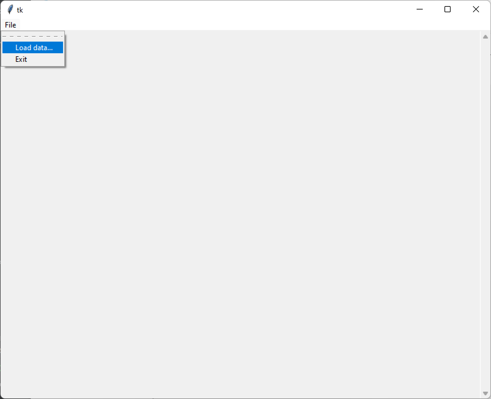

This will open up a dialog window for selecting a dataset to load.
From there, click the `Select file...` button. This will open a file picker. Select the top level data folder. If using 
the data provided in this repo, that will be the `Dataset` directory.

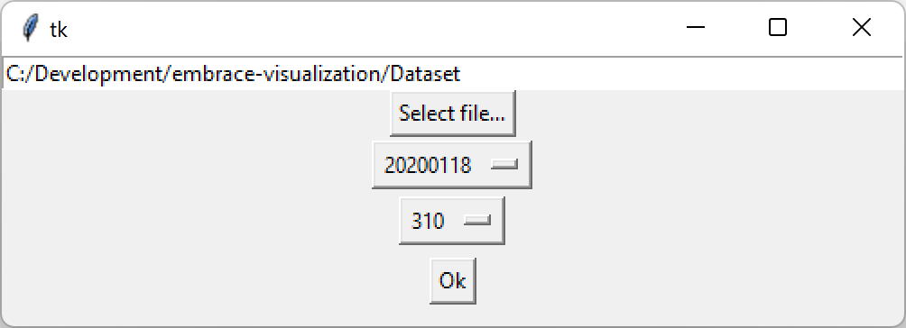

After the directory is selected, the dropdown boxes will automatically populate with the dates and patients for which 
data is available. When the data is updated, the patient number is refreshed based on the new date. Once the date and 
patient are selected, click the `Ok` button to continue to the time series selection.

## Selecting Data Series
When the patient is selected, the time series selector opens up and will present a list of available features that can 
be graphed.

To select data, click on the desired features and then click the right arrow. This will move those features to the box
on the right. Once all desired features are selected, click `Finish` to load the data.

## Viewing the Data
When the data is loaded, the main window will render the graphs along with a few other UI elements.
* In the top right, the aggregation settings will be shown along with a Reset button, which will revert back to using
the full raw data.
* A range slide is shown in the middle, with labels on either side indicating the time range that is desired.

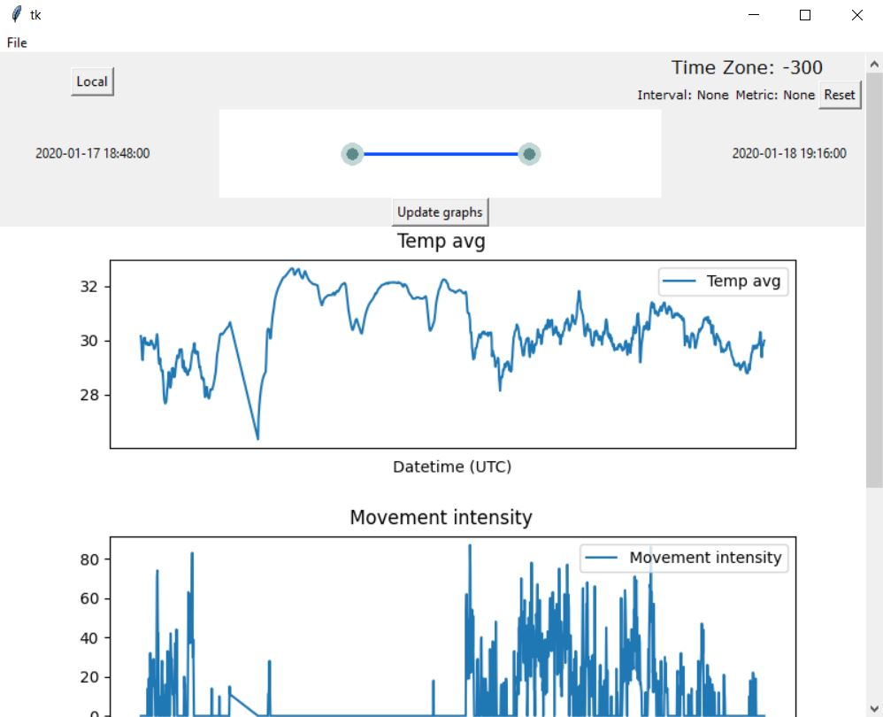

The graph page is scrollable, so the user can scroll up and down to view the graphs that don't fit in the window.

### Getting Graph Values
To get the exact values of data points, hover the mouse cursor over a point on the graph. A tooltip will display the
value of the point that the mouse is over.

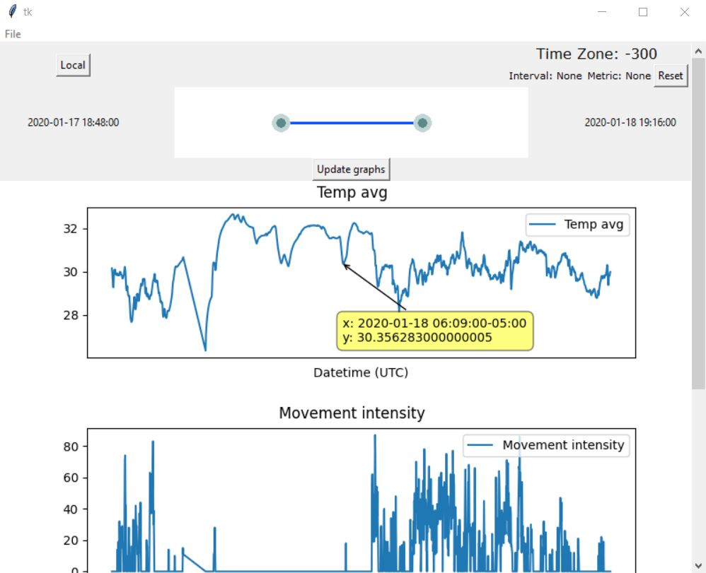

### Zooming In/Out
To zoom in and out, the handles of the range slider can be dragged to adjust the values. Once the values are selected, 
click `Update graphs` to redraw the graphs with the selected time range.

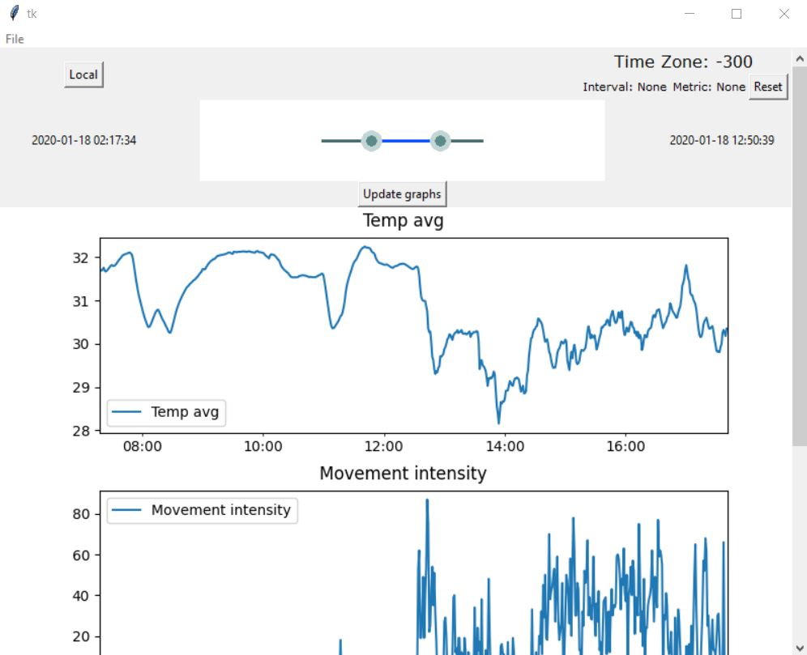

### Modifying Aggregation Settings
To modify the aggregation settings, right-click on any graph and select the desired settings.

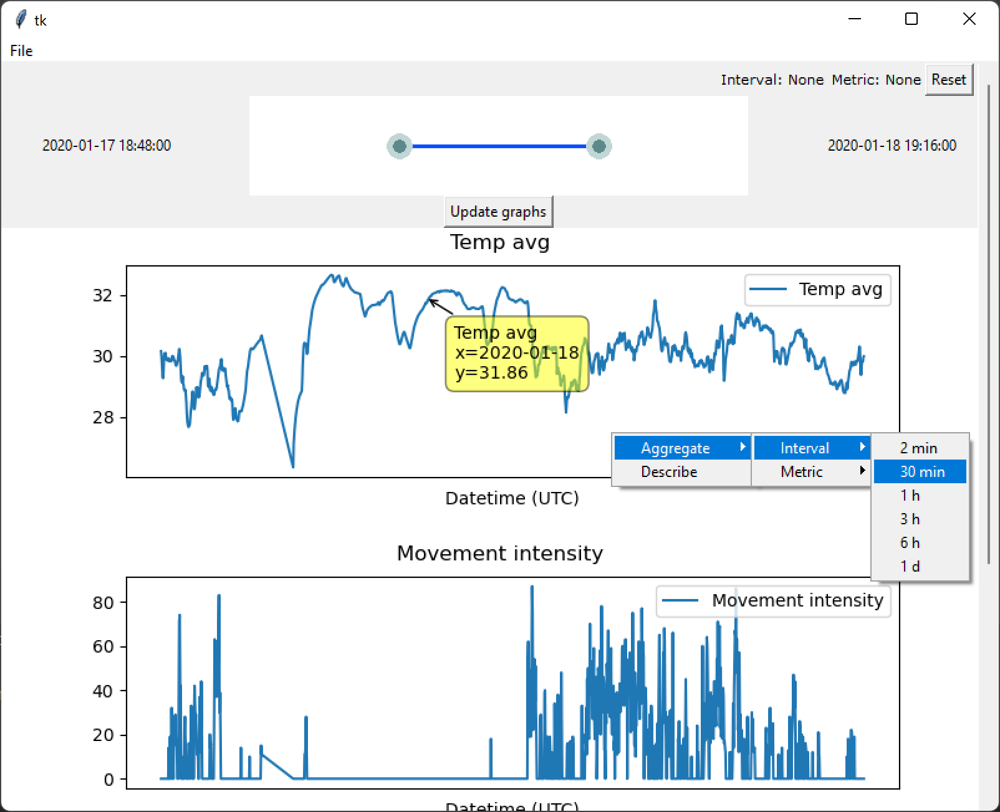

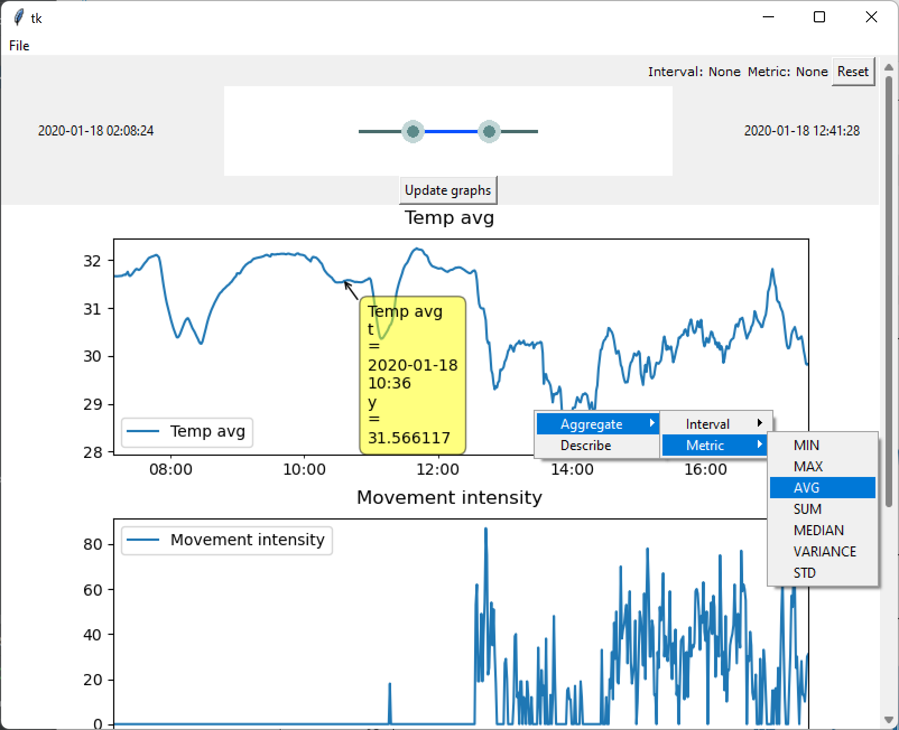

Note: For the sample dataset included here, data points are available for every minute. This means that standard 
deviation and variance will be a flat 0 if the 1-minute interval is selected.

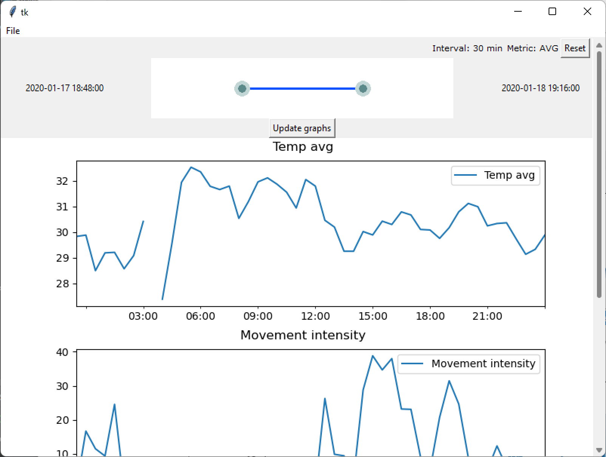

### Viewing Summary Statistics
To view the summary statistics for a graph, right-click on the graph and select the `Describe` option. This will open a 
popup that will display the summary statistics for the graph data.

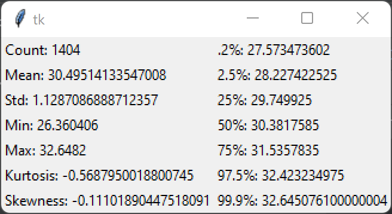

Note: The values in the column on the right are percentiles.

### Changing Time Zone
To change the time zone from the Local Time Zone recorded in the file and to Universal Coordinated Time (UTC), press the button at the top left of the Main Window. This button will read either `Local` or `UTC`. What timezone the button is currently reading is the timezone the information is currently showing in. You can observe the change in time on the times on either side of the range slider.

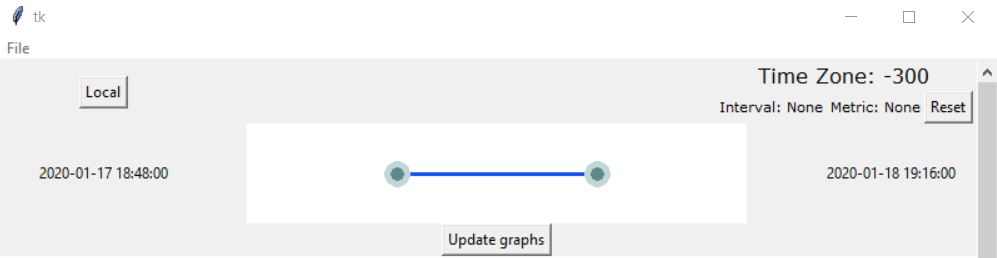
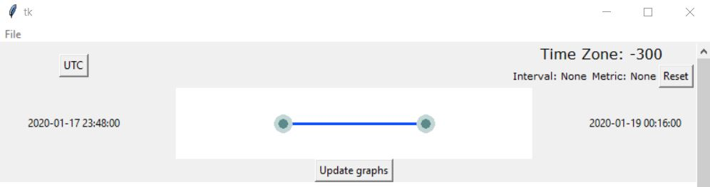
